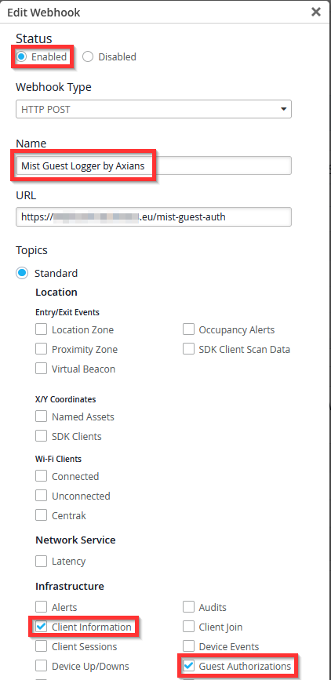

# Juniper Mist Guest logger - Webhook version

mist-guest-logger-webhook.py is a Flask-based HTTP webhook receiver that listens on port 3000 for POST requests from the Juniper Mist platform at the /mist-guest-auth endpoint. It handles two event types:

- guest-authorizations: Logs guest Wi-Fi authorization events (raw JSON + structured CSV with daily rotation), and tracks the MAC addresses of authorized guest clients in memory.
- client-info: Logs network client telemetry, but only for previously authorized guests — non-guest clients are silently skipped. This allows correlating guest identity with network behavior without capturing unrelated clients.

All log files rotate daily and are written to two directories: app-logs/ (application/debug logs) and guest-logs/ (guest data as both raw .log and structured .csv files). The in-memory guest MAC address set is flushed daily to prevent unbounded memory growth.

## Webhook setup & configuration
The webhook receiver runs over plain HTTP on tcp/3000 and must be exposed over HTTPS to be reachable by Mist. Deploy a reverse proxy in front of the service, then point your Mist Webhook configuration to:

`https://<your-reverse-proxy-url>/mist-guest-auth`



## Running the script with Docker Compose (Recommended!)
For ease of use and portability, a Docker Compose installation method is provided:
1. Extract all files from the folder into a directory
2. Build the Docker Compose image and start the container: `docker compose build && docker compose up -d`

## Running the script without Docker Compose
Alternatively, you can just run the script without Docker:
1. Install python
2. Check if pip is installed ``` python -m pip --version ```. If not installed, install it: https://pip.pypa.io/en/stable/installing/
3. Upgrade pip ``` python.exe -m pip install --upgrade pip ```
4. Install additionnal required libraries:
    1. ```pip install -r requirements.txt```
5. From a terminal, start the script: ``` python mist-guest-logger-webhook.py ```

## Security
You can configure your firewall to allow traffic only from the Webhooks Source IP addresses for your Mist cloud instance:
https://www.juniper.net/documentation/us/en/software/mist/automation-integration/topics/concept/webhooks-source-addresses.html

## Viewing Guest user logs
Logs are stored in the guest-logs/ repository.

## Viewing container logs
`docker logs mist-guest-logger`

## Updating the script
When the Python script is updated, you need to rebuild and restart the container: `docker compose build && docker compose up -d`
